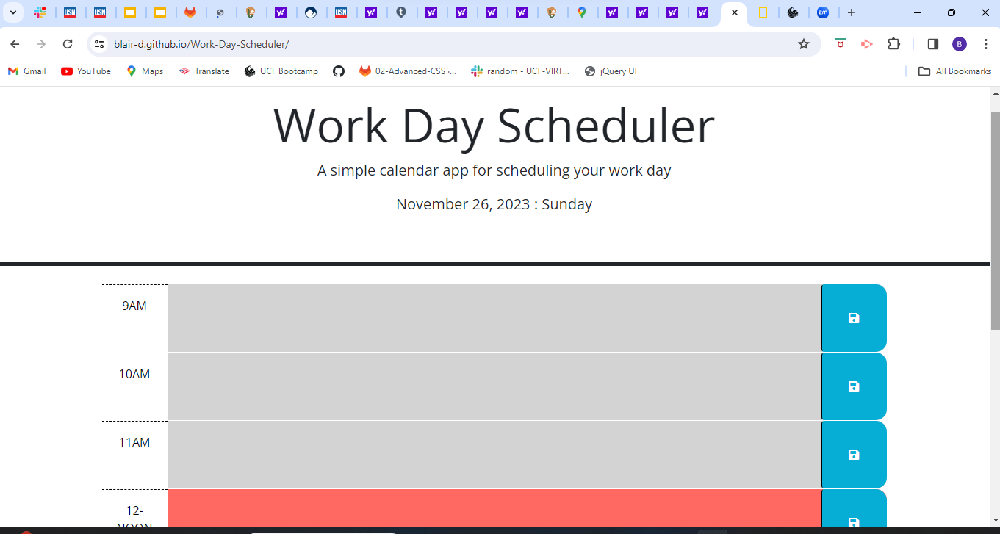
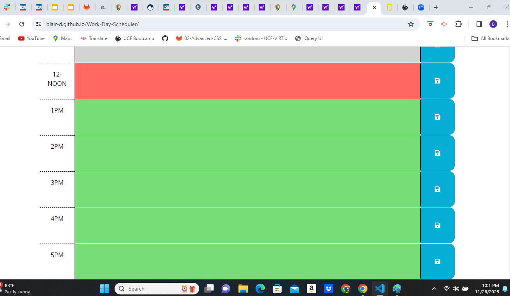

# Work-Day-Scheduler
Deployed Application: https://blair-d.github.io/Work-Day-Scheduler/

#DESCRIPTION The motivation behind this project was to improve a work day scheduler. The improvements made were to enable the user to add appointments and then have the ability to store those new appointments in local storage. Also, visually the page was updated so the user knows exactly what time block they are currnetly in with past, present, and future hour block being color coordinated with real live time. This have been a learning experience on how JQuery and API's can add additional benifits for the user.

#sreenshot
!
!
#USAGE
To use this website simply click on the hour block in which you wish to add an appointment. Type in the information you wish to be displayed. Next, select the save button icon at the end of that hour block. Your appointment will be dave in local storage and will reamin visible, even when page is reloaded. Also, the colors on the page for the hour blocks will indicate if the hour block is in the past present or future, making it easier to view your scheudle at a glance.

#LICENSE
License A short and simple permissive license with conditions only requiring preservation of copyright and license notices. Licensed works, modifications, and larger works may be distributed under different terms and without source code.